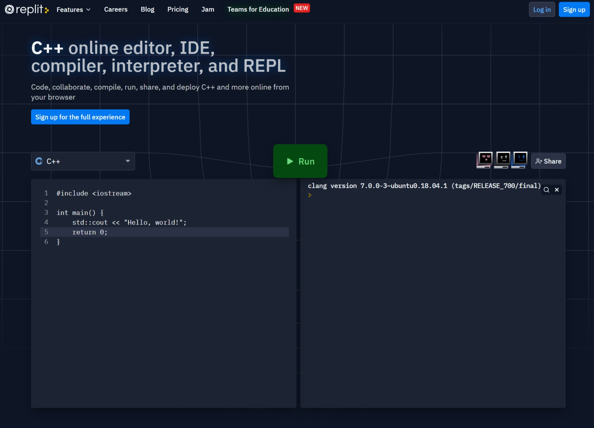
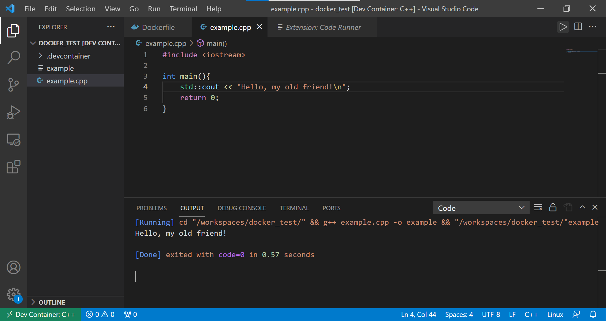

# Compiling & Running
```{index} compiling
```

Whereas Python is mostly fairly simple to get working with straight away, C & C++ have a few extra hurdles before you can get the computer to run your code. Your program must be compiled (and sometimes linked to other libraries) to produce a separate executable file, before that file can be run. In this section we present a number of ways of approaching this, listed in order of ease of use.

## Web based solutions
```{index} compiling:web-based 
```

There are a variety of platforms which will allow you to run small one file C & C++ programs or code snippets directly from your browser. A (non-exhaustive) list of examples includes:
- [Replit](https://replit.com/languages/cpp)
- [Codepad](https://codepad.org/)
- [Ideone](https://ideone.com/)



On each of these platforms you can cut & paste code from the examples in this primer, and then run the code to generate output, usually with a single click of the mouse on the button labelled `Run`. Note that not all platforms will let you interact with your code while it runs (Replit will, as well as linking to your GitHub account if you'd like to save your work).

## Visual Studio Code & Devcontainers
```{index} compiling: via docker
```

A more local option is to take advantage of the combined power of Docker and Visual studio code to provide files which you can often compile with one click.



To begin, fork the accompanying [examples repository](https://github.com/ese-msc/c-examples) and download it, then with Docker desktop running, open your local repository in VS code. You will be presented with a query banner "Folder contains a Dev Container configuration file. Reopen folder to develop in a container (learn more).". Select "Reopen in Container". This will restart the VS Code editor window, while connecting to a Docker container build from the repository [C examples Dockerfile](https://ese-msc/c-examples/.devcontainer/Dockerfile). This container has `git` and `Python` installed, together a working linux C++ compiler (the GNU compiler) and some useful VS Code extensions installed.

For simple non-interactive C++ files, you can now build & run them with the Run Code button (ctrl+alt+N). For interactive files, you will need to run the program yourself using (for a file `hello.cpp` in the current directory) a command like:

```
g++ -o hello hello.cpp
./hello
```

Here `g++` is the name of the linux GNU C++ compiler, the `-o` option specifies the name of the output executable file (the default is `a.out`) and we must list the `.cpp` source file to compile into it. The second line then runs our new executable.

## Compiling natively

### Windows: Visual Studio
```{index} compiling:windows native
```

For Windows users only, you can obtain the Microsoft C/C++ compiler by downloading the Visual Studio community package [here](https://visualstudio.microsoft.com/vs/community/). Visual Studio is a sister package to Visual Studio Code, which combines build tools for several programming languages along with an Integrating Development Environment (IDE) to code them in.

To compile a file, we must create a matching Visual Studio solution file. For a one line program, the easiest way to do this is to start from the `console application` template project, and modify the default file appropriately. We can then compile and run our source using the `Local Windows Debugger` play button, or  the `Debug>Start Debugging (F5)` menu option.

### Apple Macs: `gcc` or `clang`
```{index} compiling:mac
``` 

Mac users have a number of routes to set up their system for C++. We recommend the first method (i.e gcc) given below, since it provides most scope to expand later, but for completeness we also document the route to install the Apple C compilers and work with homebrew.

#### gcc, homebrew and VS code

The open source third-party mac package manager [Homebrew](https://brew.sh/) provides preconfigured versions of a number of unix-like packages, including versions of the GNU C/C++ compilers.

Most Mac users on the course will already have Homebrew installed, but for those that don't, the application itself can be downloaded using the script & instructions from the Homebrew homepage. Additional (and alternative) instructions can be found [here](https://docs.brew.sh/Installation). Once this installation is complete, running the command:

```
brew install gcc
```

will install a recent version of `gcc` (version 13 as of early December 2023) as well as placing it in your standard path. Once installed, (and having openned a new terminal) you can confirm that things work by running the following command in a terminal

```
gcc-13 --version
```

You should see a response something like

```
gcc-13 (Homebrew GCC 13.2.0) 13.2.0
Copyright (C) 2023 Free Software Foundation, Inc.
This is free software; see the source for copying conditions. There is NO
warranty; not even for MERCHANTABILITY or FITNESS FOR A PARTICULAR PURPOSE.
```

To compile a C++ file called `hello.cpp` into an exectuable called `hello`, then run it, use a command like

```
g++-13 -o hello hello.cpp
./hello
```

Here `g++-13` is the name of your new GNU C++ compiler (version number 13), the `-o` option specifies the name of the output file (the default is `a.out`) and we must list the `.cpp` source file to compile into it. The second line then runs our new executable file which we have just compiled.

Remember, we only need to compile once, and then we can run the executable as many times as we like. If we make any changes to the source code, we must recompile before we can run the new version and see the results.

#### Xcode

An alternative is to install the [Xcode command line tools](https://mac.install.guide/commandlinetools/4.html) by following the instructions on the linked page (if you haven't already). This gives you access to the Apple version of the clang compiler. 

you can confirm that things work by running the following command in a terminal

```
cc --version
```

You should see a response something like

```
Apple clang version 14.0.0 (clang-1400.0.29.202)
Target: arm64-apple-darwin21.6.0
Thread model: posix
InstalledDir: /Library/Developer/CommandLineTools/usr/bin
```
although the precise values may be a little different.

To compile a C++ file called `hello.cpp` into an exectuable called `hello`, then run it, use a command like

```
c++ -o hello hello.cpp
./hello
```

Here `c++` is the name of your C++ compiler, the `-o` option specifies the name of the output file (the default is `a.out`) and we must list the `.cpp` source file to compile into it. The second line then runs our new executable.


### Linux/WSL: `gcc` or `clang`
```{index} compiling:linux
```

Linux users are likely to find C compilers are either installed by default on most desktop distributions, or readily installable via the system package manager. Given the wide range of distributions in use, we can't hope to cover all of them, but for some of the more popular ones:

- On Ubuntu/Debian (including WSL), use `sudo apt install build-essential`
- On Arch Linux, use `sudo pacman -S gcc`
- On Red Hat/Fedora use `sudo yum install devtoolset-8`
 
Once installed,  you can confirm that things work by running the following command in a terminal:

```
gcc --version
```

You should see a response something like

```
gcc (Ubuntu 11.4.0-1unintu1~22.04) 11.4.0
Copyright (C) 2021 Free Software Foundation, Inc.
This is free software; see the source for copying conditions. There is NO
warranty; not even for MERCHANTABILITY or FITNESS FOR A PARTICULAR PURPOSE.
```

To compile a C++ file called `hello.cpp` into an exectuable called `hello`, then run it, use a command like

```
g++ -o hello hello.cpp
./hello
```

Here `g++` is the name of your new GNU C++ compiler, the `-o` option specifies the name of the output file (the default is `a.out`) and we must list the `.cpp` source file to compile into it. The second line then runs our new executable.

## Summary

You should now have found a method to compile C/C++ programs which works for you. It is fine to use either of the first two options for the duration of this primer, but you will find a local compiler much more use during the actual Advanced Programming course.

In the next section we will start using our compiler to actually build some C++ code, as well as identifying more similarities and differences between C/C++ and Python.

